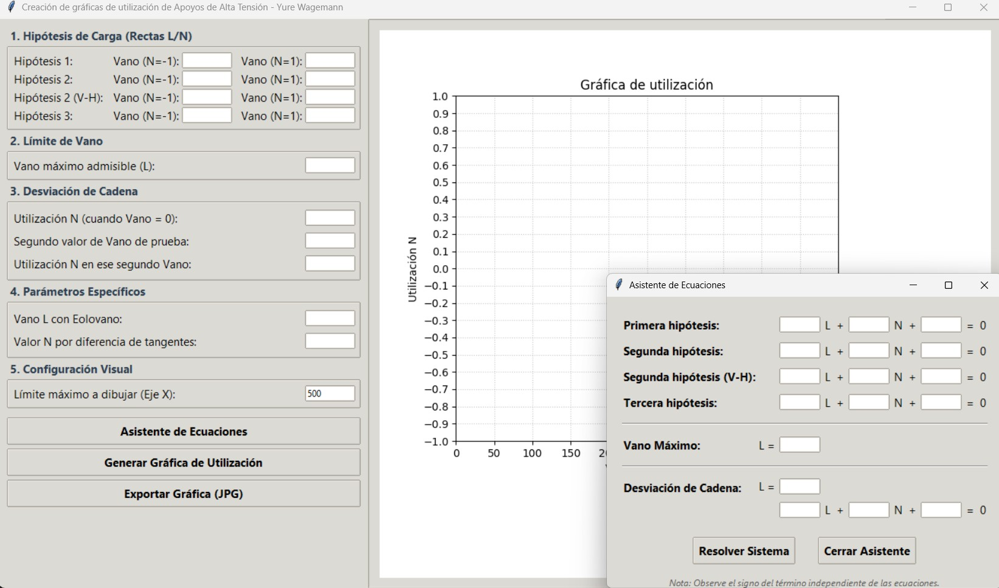

# Gráficas de Utilización de Apoyos en Alta Tensión

Aplicación visual en Python para calcular y generar gráficas de utilización en apoyos de Alta Tensión.


## De qué trata este proyecto

Este programa es una herramienta de escritorio diseñada para facilitar el cálculo de líneas eléctricas de Alta Tensión. Su objetivo principal es dibujar de forma automática la gráfica de utilización de un apoyo (una torre eléctrica), ahorrando tiempo y evitando errores. Herramienta hecha principalmente para la asignatura de 
Instalaciones Eléctricas de Alta Tensión en la Universidad de Jaén, impartida por Dr. Francisco José Sánchez Sutil, pero utilizable en muchos contextos.

El usuario solo tiene que introducir los datos en las casillas y el programa se encarga de realizar todo el trazado matemático correspondiente.




## Funciones Principales

* Interfaz: Ventana principal dividida por secciones para introducir los datos y verificar la gráfica resultante.

* Configuración visual: El límite del eje X (Vano L) viene configurado a 500 metros por defecto, se puede modificar a medida desde la propia ventana.

* Trazado inteligente: El programa traza las rectas de las diferentes hipótesis de carga (viento, hielo, etc.). Estas rectas se dibujarán en la gráfica siempre y cuando uno (o ambos) punto calculado esté en los límites de los ejes.

* Límites Estructurales: Marca visualmente el límite del vano máximo admisible y la restricción provocada por la inclinación de la cadena de aisladores.

* Punto Específico: Permite comprobar un punto exacto de la torre en la gráfica introduciendo su valor de L y N.

* Asistente de Ecuaciones: Un módulo extra que calcula y despeja matemáticamente las variables L y N a partir de las ecuaciones de la forma A*L + B*N + C = 0 (de las distintas hipotesis y casos que vayan a tener). Al darle a resolver, el asistente envía esos resultados a la ventana principal de forma automática.

* Exportación a JPG: Permite guardar la gráfica generada en el ordenador.

## Tecnologías Utilizadas

Este programa ha sido creado en Python y utiliza las siguientes librerías:

* Tkinter
* Matplotlib
* NumPy

## Cómo instalar y usar el programa

1. Descarga el proyecto

2. Instala las dependencias: Abre la consola en la carpeta del proyecto y ejecuta el siguiente comando para instalar las librerías necesarias:
   ```bash
   pip install -r requirements.txt
   ```

3. Inicia el programa: Ejecuta el archivo principal de Python para abrir la aplicación:
   ```bash
   python generacionGraficosUtilizacion.py
   ```

#### Desarrollado por Yure Wagemann Valadares Magalhães.
